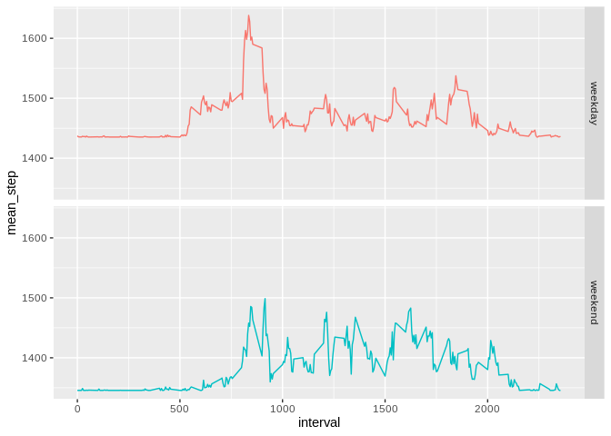

## Loading and preprocessing the data


```r
library(readr)
suppressPackageStartupMessages(library(dplyr))
suppressPackageStartupMessages(library(ggplot2))

df = read.csv('activity.csv')
```

## What is mean total number of steps taken per day?


```r
steps_per_day = aggregate(steps~date, data=df, sum)
hist(steps_per_day$steps, main="Total number of steps per day", 
     xlab="Steps")
```

<!-- -->

```r
mean_steps = mean(steps_per_day$steps, na.rm = TRUE)
median_steps = median(steps_per_day$steps, na.rm = TRUE)
print(paste0("The mean number of steps is ", mean_steps))
```

```
## [1] "The mean number of steps is 10766.1886792453"
```

```r
print(paste0("The median number of steps is ", median_steps))
```

```
## [1] "The median number of steps is 10765"
```

## What is the average daily activity pattern?


```r
df_av = df %>% 
        group_by(interval) %>%
        summarize(mean_step = mean(steps, na.rm = TRUE), .groups = 'drop') 

ggplot(df_av, aes(interval, mean_step)) +
        geom_line()
```

<!-- -->

```r
max_interval = df_av$interval[which.max(df_av$mean_step)]
print(paste0("5-minute interval which contains the maximum number of steps is ", max_interval))
```

```
## [1] "5-minute interval which contains the maximum number of steps is 835"
```

## Imputing missing values


```r
na_summary = table(is.na(df$steps))
print(paste0("Number of missing values is ", as.numeric(na_summary[2])))
```

```
## [1] "Number of missing values is 2304"
```

```r
df_im = df
df_im$steps[which(is.na(df_im$steps))] = median_steps

steps_per_day_im = aggregate(steps~date, data=df_im, sum)

hist(steps_per_day_im$steps, main ="Total number of steps in imputed df", xlab="Steps")
```

<!-- -->

```r
mean_steps_im= mean(df_im$steps, na.rm = TRUE)
median_steps_im = median(df_im$steps, na.rm = TRUE)

print(paste0("Imputing of missing values affected median value and caused its decrease: (", median_steps, " in original dataset vs ", median_steps_im," in imputed dataset)"))
```

```
## [1] "Imputing of missing values affected median value and caused its decrease: (10765 in original dataset vs 0 in imputed dataset)"
```

```r
print(paste0("Imputing of missing values affected mean value and caused its decrease: (", mean_steps, " in original dataset vs ", mean_steps_im," in imputed dataset)"))
```

```
## [1] "Imputing of missing values affected mean value and caused its decrease: (10766.1886792453 in original dataset vs 1444.28324225865 in imputed dataset)"
```

## Are there differences in activity patterns between weekdays and weekends?


```r
df_im$date = strptime(df_im$date, format = "%Y-%m-%d")
df_im$weekday = weekdays(df_im$date)
df_im$weekend <- ifelse(weekdays(df_im$date) %in% c("Samstag", "Sonntag"), "weekend", "weekday")
df_im_av = df_im %>% 
        group_by(weekend, interval) %>%
        summarize(mean_step = mean(steps, na.rm = TRUE), .groups = 'drop')
ggplot(df_im_av, aes(interval, mean_step, col = weekend)) +
        geom_line()+ facet_grid(weekend ~ .)+ theme(legend.position = "none")
```

<!-- -->
